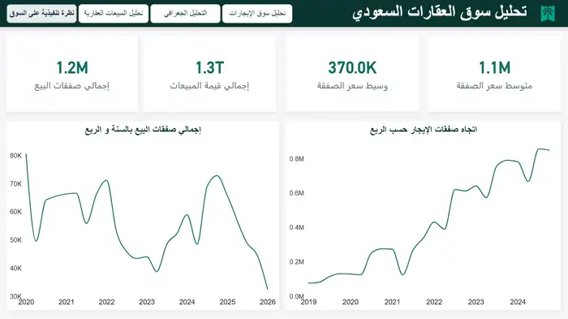

# Saudi Real Estate Analytics

End-to-end portfolio project for analyzing Saudi Arabia's real estate **sales and rental markets** using official public datasets.

**Pipeline:** Raw Data → Python → SQL Server → Power BI

## Project overview

This project combines Ministry of Justice (MOJ) sale transactions with Real Estate General Authority (REGA) rental indicators, then turns the raw files into a structured analytical model and an interactive Power BI report.

| Area | Scope |
|---|---|
| Sales source | MOJ real estate sale transactions |
| Rental source | REGA rental market indicators |
| Raw sales loaded | 1,269,500 rows |
| Final sales fact | 1,222,289 transactions |
| Rental indicators | 17,792 rows |
| Main tools | Python, pandas, SQL Server, Power BI, DAX, Power Query |
| Final report | 4 analytical pages |

## Business questions

- How is transaction activity changing over time?
- Which regions, cities, and neighborhoods drive the market?
- How do average and median sale prices differ?
- Which property classifications dominate sales?
- How does rental activity differ by property type and city?
- Are averages being distorted by unusually expensive transactions?

## End-to-end workflow

### 1. Data ingestion — Python

Python and pandas are used to discover the source files, standardize headers, convert dates and numeric fields, preserve Arabic text, and load the raw datasets into SQL Server.

See [src/ingestion/load_raw.py](src/ingestion/load_raw.py) and [docs/ingestion.md](docs/ingestion.md).

### 2. Data profiling and quality checks — SQL

The raw layer was profiled before building the final model. Important findings included duplicate transaction references, inconsistent Arabic region spellings, zero or missing area values, mostly unavailable Hijri dates, and extreme price outliers.

Duplicate-sale handling uses `ROW_NUMBER()` so only one row per transaction reference proceeds to the final model.

See [docs/data-quality.md](docs/data-quality.md).

### 3. Relational model — SQL Server

The cleaned relational layer separates reusable dimensions from sale and rental facts.

Core tables:
- `core.Region`
- `core.City`
- `core.Neighborhood`
- `core.SalePropertyClassification`
- `core.RentalPropertyType`
- `core.SaleTransaction`
- `core.RentalIndicator`

Sales and rentals intentionally remain separate facts because they have different grains.

See [docs/data-model.md](docs/data-model.md).

### 4. Analytical layer — SQL views

Reusable views flatten the relational model for reporting:
- `analytics.vw_SalesAnalysis`
- `analytics.vw_RentalAnalysis`

### 5. Reporting — Power BI

The final Power BI report contains four pages:

1. **Executive / Market Overview** — KPIs and market trend.
2. **Sales Market Analysis** — transactions, prices, classifications, and outliers.
3. **Geographic Analysis** — region, city, and neighborhood comparisons.
4. **Rental Market Analysis** — quarterly activity, average rental values, and property types.

See [powerbi/README.md](powerbi/README.md).

## Dashboard preview

### Executive / Market Overview


### Sales Market Analysis


### Geographic Analysis


### Rental Market Analysis


These screenshots show the final green-themed Power BI report used in the portfolio version of the project.

## Selected analytical findings

- Riyadh, Makkah, and the Eastern Province together account for **67.6%** of imported sale transactions.
- The typical sale price is better represented by the **SAR 370K median** than by the mean because the distribution contains large outliers.
- Apartments represent **73.3%** of recorded rental deals in the analyzed rental indicators.

These findings describe the imported datasets and should not be interpreted as official market forecasts.

## Repository structure

```text
.
├── assets/
│   └── screenshots/
├── docs/
├── powerbi/
├── sql/
│   ├── raw/
│   ├── core/
│   └── analytics/
├── src/
│   └── ingestion/
├── .gitignore
└── requirements.txt
```

Raw source datasets are intentionally excluded from Git.

## Portfolio

A formatted case-study version of this work is included in my data analytics portfolio:

**Portfolio:** https://heyzine.com/flip-book/a90b80ff5f.html

---

**Ali Alwabari**  
Computer Information Systems | Data Analytics | SQL | Python | Power BI
